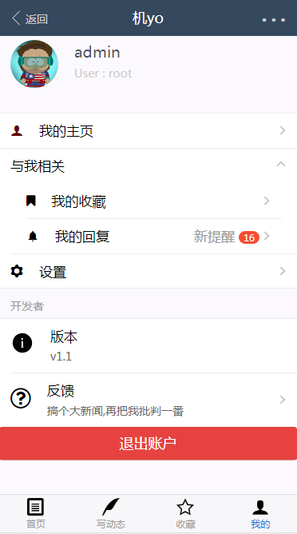

# hos

> 一个 Vue.js 开发的社区
## 关于 ##
2019届学生,目前大三.出于学习和自我提升写了这个社区项目.利用课余时间进行开发,由于期末和六级考试中断了一段时间.
项目是前后端分离的,全部数据都是用axios传json.前端用vue+vuex+vue-router+axios,后端为node,数据库为MySQL,Restful风格的接口设计,做到了真正数据交互.
项目完成度89.99%


## 技术栈 ##
-	前端: vue2 +vux2.9.2+ vuex + vue-router + webpack + babel + ES6/7 + axios+ less+ flex + 图标字体 
-	后端: node+jwt
-	数据库: mysql
-	第三方插件: mavon-editor

## DONE ##
- 登录/注销
- jwt用户认证
- 文件上传
- markdown 编辑器
- 收藏
- @评论
- 图片懒加载
- 用户资料修改,更换头像
## TODO ##
- 通知提醒
- 话题板块
- 改善白屏时间


## 线上地址 ##
   线上地址：>[http://dushizz.top/hos](http://dushizz.top/hos)
   <br>
   请用 chrome/firefox 的手机模式,由于服务器在美国故访问缓慢
> 用户名:root  <br>
> 密码:admin
 
##### 扫码查看,内容可能不是最新:
<br>


## 后端项目地址
   后端项目地址：>[GitHub：https://github.com/Tyrone2333/hos_Server](https://github.com/Tyrone2333/hos_Server)
    
## 效果演示
### 主界面 ###

### md编辑器 ###

### 收藏 ###

### 我的 ###

### 文章页&&评论 ###

### 用户页 ###

### 设置 ###


## 使用

``` bash
# install dependencies
npm install

# serve with hot reload at localhost:10086
npm run dev

# build for production with minification
npm run build

# 打开测试服务器
npm run testServer
```

##更新记录

| 版本号 | 版本时间 | 更新内容 |
| :----| :---- | ------ |
| 1.0 | 2018/8/17 | 1.优化用户主页滚动 <br> 2.统一错误管理|
| 1.1 | 2018/9/13 | 1.抽离了一个基本组件 cellList <br> 2.在 store 中添加版本信息 |


